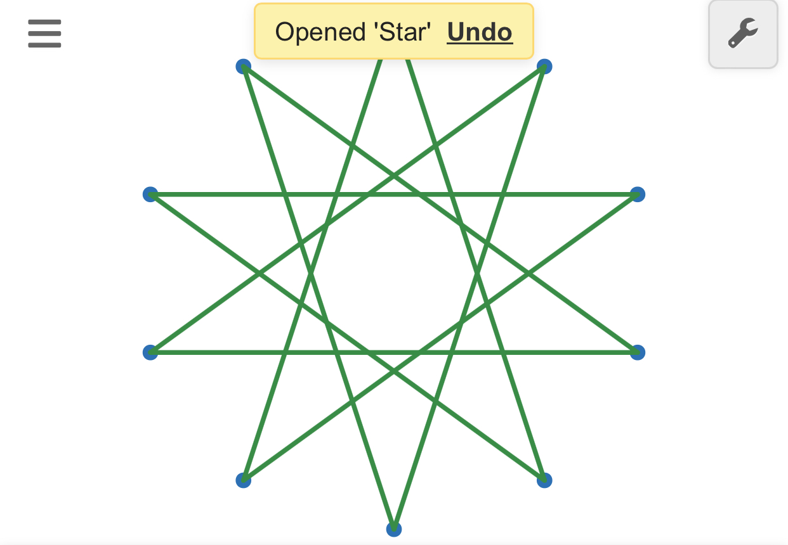

# desmos-polytope

a desmos polytope viewer! right now i have regular polygons down (including stars!). anything that has a schlafli symbol i can draw. bext, i want to do polyhedra, but that will be ***much*** harder.

to view: go to desmos and paste the contents of the `.desmos` file into desmos.
